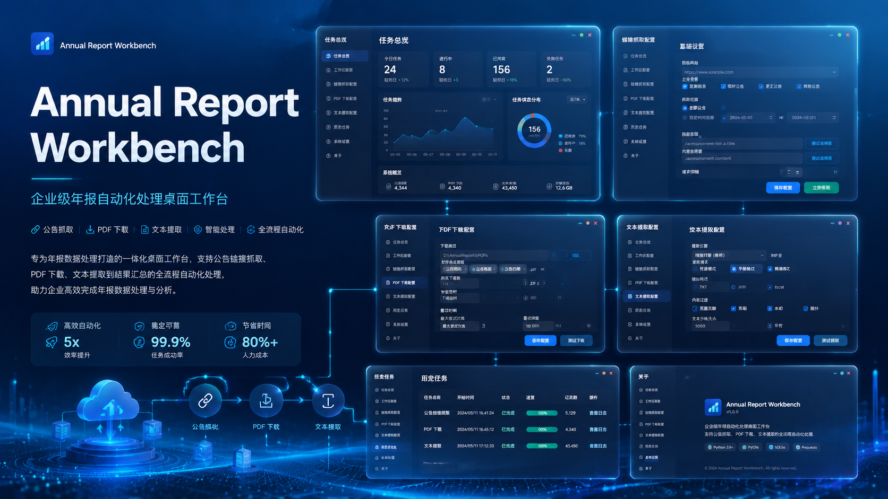

# Annual Report Workbench

一个用于年报公告抓取、PDF 下载和文本提取的桌面工具。

## 项目简介

这是一个基于 Python + Vue + pywebview 的桌面应用，适合批量处理年报相关数据，并在界面中查看进度、日志和历史任务。

应用面向年报数据处理场景，提供从公告链接抓取、PDF 下载到文本提取的完整处理链路。相比命令行脚本，它更适合需要批量运行、查看过程状态、保留历史记录和反复调参的桌面工作流。

## 主要功能

- 公告链接抓取
- PDF 批量下载
- PDF 文本提取
- 单阶段运行和全流程串联
- 任务暂停、继续和终止
- 实时日志、进度和图表展示
- 历史任务记录和配置同步

## 快速开始

1. 安装 Python 依赖：`pip install -r requirements.txt`
2. 安装前端依赖：`cd webui && npm install`
3. 构建前端：`npm run build`
4. 类型检查：`npm run typecheck`
5. 启动桌面程序：`python -m webview_console`

## 常用命令

- 同步版本到更新清单：`python .\scripts\sync_update_manifest.py 1.0.1`
- 构建 GUI：`powershell -ExecutionPolicy Bypass -File .\scripts\build_gui.ps1 -Mode onedir`
- 构建安装包：`powershell -ExecutionPolicy Bypass -File .\scripts\build_installer.ps1 -Mode onedir`
- 运行测试：`python -m unittest .\tests\test_release_metadata.py`

## 仓库地址

- GitHub: https://github.com/Little-pig-create/AnnualReportWorkbench
- Gitee: https://gitee.com/xiaozhusir/AnnualReportWorkbench
